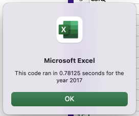
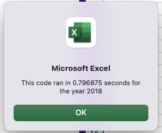

# Stock-analysis

## Overview of Project

This project is to help Steve analyze a dataset that includes the entire stock market over the last few years. Since, there are thousands of stocks, so the code used for analyzing from 2017, 2018 might not be fast enough. In order to make the code executing time shorter, I refactored code to run the VBA script run faster.

## Results

## Summary
