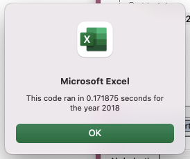

# Stock-analysis

## Overview of Project

This project is to help Steve analyze a dataset that includes the entire stock market over the last few years. Since, there are thousands of stocks, so the code used for analyzing from 2017, 2018 might not be fast enough. In order to make the code executing time shorter, I refactored code to run the VBA script run faster.

## Results

## Summary

- What are the advantages or disadvantages of refactoring code?

  - The advantages of refactoring code are that it improves the code quality without changing its external behaviour, helps to find bugs, makes programs run faster, it's easier to understand the code, improves the design of software, etc.

  - The disadvantages are that it may introduce bugs, may be expensive, can take up a lot of time.

- What are the advantages or disadvantages of the original and refactored VBA script?
  - The advantage was that the VBA script runs much faster after refactoring.
  - The disadvantage of my refactored script is that it took a long time because it introduced new bugs to my script but i managed to resolve it.
